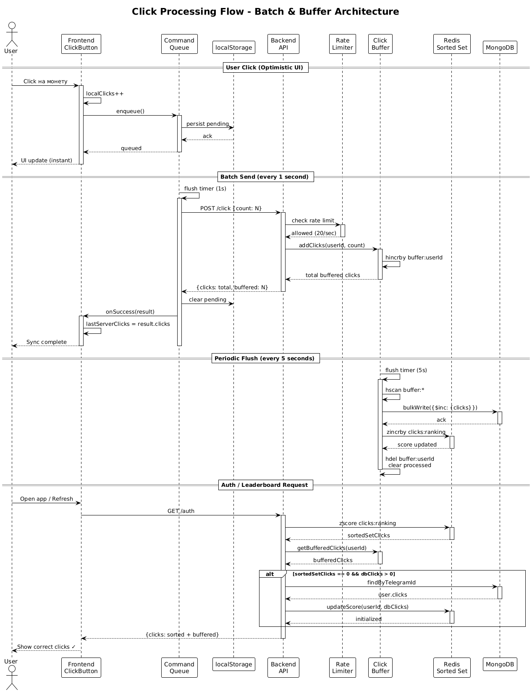

# Clicker TMA

Clicker-игра в формате Telegram Mini App с лидербордом и real-time синхронизацией прогресса между пользователями.

## Архитектура



## Функционал

### Что умеет
- **Кликер** - нажимай на CryptoBot лого и зарабатывай очки
- **Глобальный лидерборд** - соревнуйся с другими игроками
- **Персональная статистика** - отслеживай свой ранг среди всех игроков
- **Telegram аутентификация** - рантайм вход через Telegram Web App
- **Юзер аватар берется из тг профиля** - в случае его отсутствия или нехватки прав его использовать - буквы имени
- **Звуковые эффекты** - кликабельный звук при взаимодействии (можно отключить)

### Технические фичи
- **Real-time обновления**
- **Автосохранение** - клики сохраняются локально и синхронизируются с сервером
- **Batch processing** - клики отправляются пачками для оптимизации
- **Персистентность данных** - прогресс сохраняется даже при закрытии приложения
- **Rate limiting** - как по ТЗ
- **Clean Architecture** - заход на попытку в CA

## Стек

### Backend
- **Runtime**: Node.js 20
- **Framework**: Express.js
- **Language**: TypeScript
- **Database**: MongoDB (хранение пользователей и прогресса)
- **Cache**: Redis (буферизация кликов, кэширование, лидерборд)
- **Testing**: Vitest
- **Deployment**: Railway (backend), MongoDB Atlas, Redis Cloud

#### Архитектура Backend
- Clean Architecture (Domain, Application, Infrastructure, Interfaces)
- Repository Pattern
- Use Cases для бизнес-логики
- DI

### Frontend
- **Framework**: React 18
- **Language**: TypeScript
- **UI Library**: Material-UI (MUI)
- **Build Tool**: Vite
- **State Management**: React Hooks (useState, useEffect, useCallback)
- **Deployment**: Vercel

### DevOps
- **Containerization**: Docker (MongoDB, Redis)
- **CI/CD**: Railway + Vercel auto-deploy


### Click Processing Pipeline
```
User Click → LocalStorage (pending) → Command Queue (1s batch) 
→ Backend API → Redis Buffer (5s flush) → MongoDB → Redis Sorted Set
```

### Data Flow
1. **Auth**: Telegram initData → HMAC-SHA256 validation → JWT-like auth
2. **Clicks**: 
   - Frontend: Optimistic UI update → Queue → Batch send
   - Backend: Rate limit → Buffer → Periodic flush → DB + Sorted Set
3. **Leaderboard**: Redis Sorted Set (real-time) + User details from MongoDB

### Performance Optimizations
- Redis buffer для batch writes в MongoDB
- Sorted Set для O(log N) рейтинга
- User cache для минимизации DB запросов
- Leaderboard cache (TTL 5 секунд)
- Frontend command queue для network optimization

## Запуск локально

### Требования
- Node.js 20+
- Docker (для MongoDB и Redis)
- npm

### Backend
```bash
cd backend

# Запустить MongoDB и Redis
docker run -d --name clicker-mongo -p 27017:27017 mongo:latest
docker run -d --name clicker-redis -p 6379:6379 redis:alpine

# Установить зависимости
npm install

# Создать .env файл
# BOT_TOKEN=your_telegram_bot_token
# MONGODB_URI=mongodb://localhost:27017/clicker
# REDIS_URL=redis://localhost:6379
# FRONTEND_URL=http://localhost:5173

# Запустить dev server
npm run dev
```

### Frontend
```bash
cd frontend

# Установить зависимости
npm install

# Создать .env файл
# VITE_API_URL=http://localhost:3000/api

# Запустить dev server
npm run dev
```

Приложение будет доступно на http://localhost:5173

## Тестирование

```bash
cd backend
npm test
```

21 тест покрывают:
- Use cases (auth, clicks, leaderboard, user rank)
- Middleware (rate limiting, Telegram auth)

## API Endpoints

- `POST /api/auth` - Авторизация пользователя
- `GET /api/user` - Получить данные пользователя
- `GET /api/user/rank` - Получить ранг пользователя
- `POST /api/click` - Добавить клики
- `GET /api/leaderboard` - Получить топ-25 игроков
- `GET /health` - Health check (Redis + MongoDB статус)

## Known issues

- Деплоить лучше в k8s, текущий деплой - не надежен, используется в качестве "технодемки". При реальной нагрузки в 1M CCU следует использовать иной стек с иными мощностями. 
